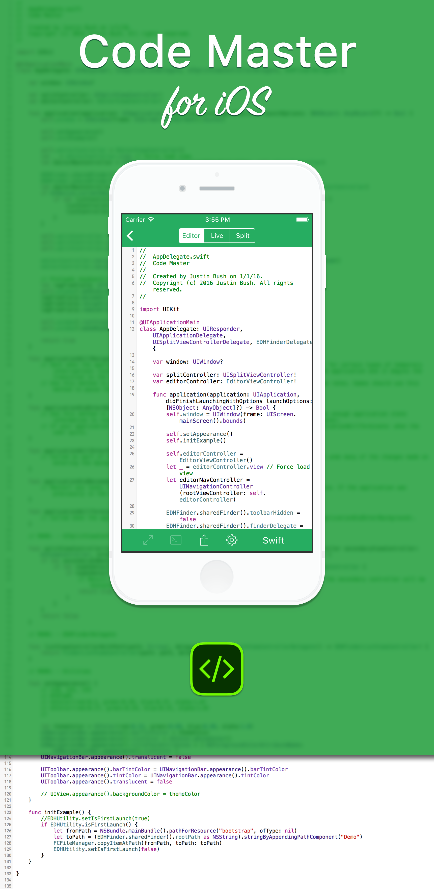

<b>Code Master</b> is an open source code editor for the iOS and OS X platforms.

## Goals
The Code Master source code editor was built from the ground up for durability, and above all, customization. The end goal is to create a beautiful product, written in Swift.

### Fundamental Goals
- Fully Funtional File Manager
- Syntax Highlighting via tmLanguages
- iCloud, Dropbox and FTP Synchronization
- Editor Customization via tmThemes
- Live Synthetic Compiling

## Completed
- [x] UI Foundation
    - [x] Basic Setup & Theme
    - [x] NavigationBar & Toolbar
    - [x] TableView for File Manager
- [x] File Manager
	- [x] Create Files & Folders
	- [x] Rename Files & Folders
	- [x] Move Files & Folders
	- [x] Delete Files & Folders
- [ ] Code Editor
	- [x] Line Numbering
	- [ ] Syntax Highlighting
	- [ ] Syntax Theming
	- [x] Basic Sharing via Email
	- [x] Live & Split Previewing
- [ ] Synthetic Runtime Environment
	- [x] HTML Web Previewing
	- [ ] Python Runtime
	- [ ] Ruby Runtime
- [ ] Sync Services
	- [ ] iCloud Drive
	- [ ] Dropbox integration
	- [ ] FTP integration
- [ ] File Restoration
	- [ ] Restore User Files from v4


## Known Errors
None as of yet.

## References
None as of yet.

## Requirements
Requires iOS 8.0 or later.
<i>Please note that the app is being built for iOS 9.</i>

## No License

Copyright © 2016 Justin Bush. All rights reserved.

```
Copyright © 2016 Justin Bush

http://choosealicense.com/licenses/no-license/
http://choosealicense.com/no-license/
```